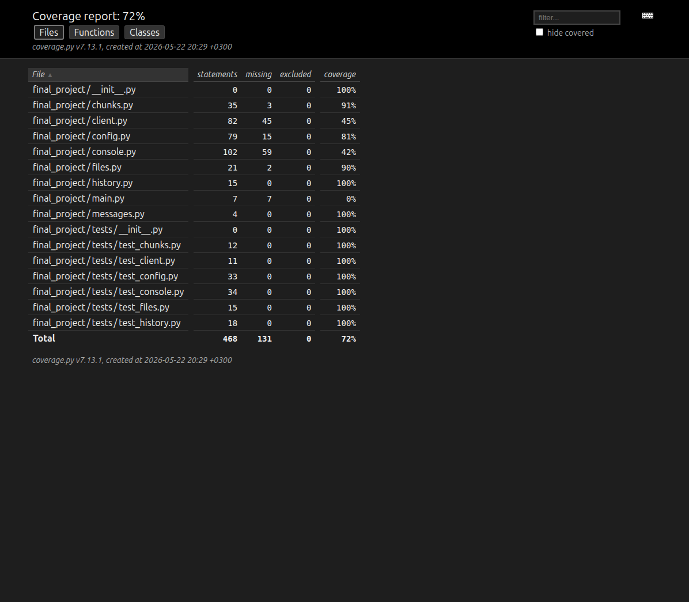

# Итоговый проект "GigaVibeMiptCode"

Актуальный текст задания доступен [здесь](https://docs.google.com/document/d/1hjEwsQd8m6-esJA37ZkGNIwK9Rn2edBC0MozFxpqxRg/edit?usp=sharing).

**Дедлайн загрузки решений: 23:59 22 мая.**

В рамках проекта вам предстоит создать собственного ИИ-ассистента с консольным интерфейсом, который будет обрабатывать пользовательский ввод, отправлять запросы к LLM и выводить пользователю ответы в разных режимах.

Решения необходимо подгрузить в форки данного репозитория.

Требования к линтерам смягчены: используйте ruff check с конфигурацией из нового ruff.toml
Проверку типов выполняем через простой запуск mypy.

## Решение

Это консольный чат с OpenAI-compatible API. Для локального запуска с Ollama:

```bash
source .venv/bin/activate
export API_KEY=<your_api_key>
export API_HOST=http://localhost:11434/v1
export MODEL=gemma3:latest
python -m final_project.main
```

Для локальной Ollama токен может быть любым непустым значением.

Вместо переменных окружения можно создать `final_project/config.yaml`:

```yaml
api_key: your_api_key_here
api_host: http://localhost:11434/v1
limit_message: 20
limit_chars: 2000
temperature: 0.2
model: gemma3:latest
stream: true
system_prompt: You are a helpful assistant.
```

Команды:

- `\q` - выход;
- `/reset` - очистить историю и экран;
- `@::path/to/file.py::` - подставить текстовый файл в сообщение;
- `/filechunk`, `/file_chunk`, `/filechunk paragraph=3`, `/filechunk len=150`,
  `/filechunk paragraph=3 -y` - обработка файла по частям.

Проверки:

```bash
source .venv/bin/activate
python -m pytest final_project/tests
python -m ruff check --config final_project/ruff.toml final_project
python -m mypy
python -m pytest --cov=final_project --cov-report=html:final_project/htmlcov final_project/tests
```

Отчёт покрытия:


